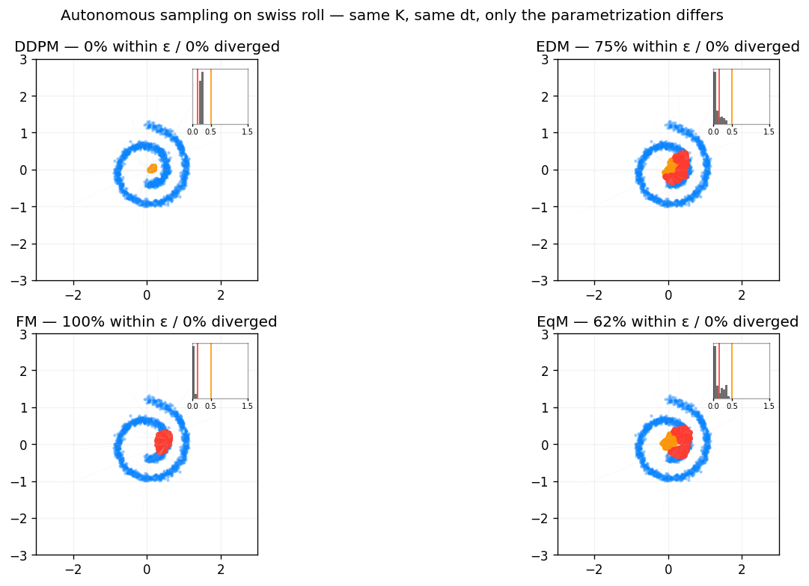
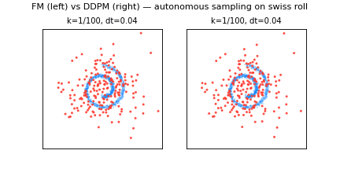
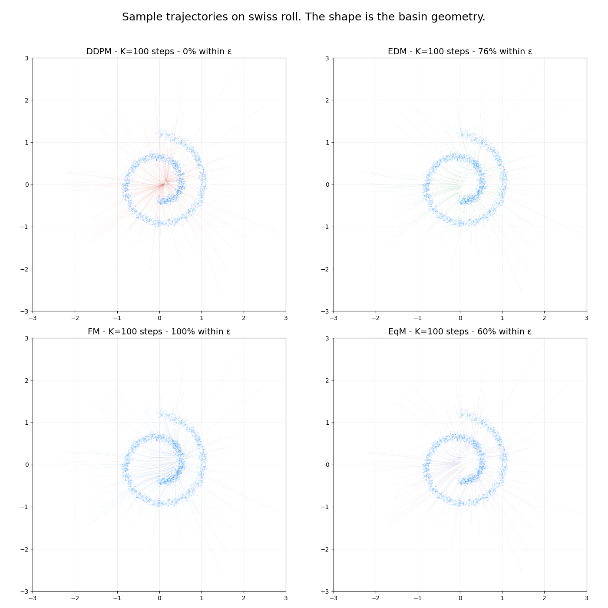

# The Geometry of Noise: Explorable Companion

Interactive marimo notebook for stress-testing diffusion parametrizations on a 2D swiss roll. Companion to Sahraee-Ardakan, Delbracio, and Milanfar (2026), [arXiv:2602.18428](https://arxiv.org/abs/2602.18428).



> Same data. Same network. Same sampler. Different parametrization. The basin geometry collapses on DDPM and holds on FM.

[](https://marimo.io/)
[](https://numpy.org/)
[](https://molab.marimo.io)
[](#license)
[](https://arxiv.org/abs/2602.18428)

## Table of Contents

- [Quick Try](#quick-try)
- [The Kill-Shot](#the-kill-shot)
- [The Animation](#the-animation)
- [What We Built](#what-we-built)
- [Trajectory Gallery](#trajectory-gallery)
- [Run Locally](#run-locally)
- [Cite](#cite)
- [License](#license)

## Quick Try

[**Open the notebook in molab**](https://molab.marimo.io/notebooks/nb_B3Ns3kjFJaT5ayKniGdJgx). Runs in your browser via WASM. No install required. Click "Train all four parametrizations", then drag the sliders.

## The Kill-Shot

At `K=100` integration steps and `dt=0.04` step size, the parametrizations split hard. Same architecture, same data, same sampler. Only the target changes.

| Parametrization | Convergence within ε of manifold |
| --- | ---: |
| **Flow Matching (FM)** | **100%** |
| EDM | 75% |
| Equilibrium Matching (EqM) | 61% |
| **DDPM** | **0%** |

Velocity-based parametrizations behave like bounded-gain systems. DDPM is a high-gain amplifier of estimation error, and near the data manifold that gain explodes. The notebook lets you watch this happen across the (K, dt) plane.

## The Animation

100-step autonomous sampling from the same Gaussian noise. FM transports samples to the swiss roll. DDPM stalls.



## What We Built

- **Four parametrizations from scratch** in pure NumPy: DDPM, EDM, Flow Matching, Equilibrium Matching. Forward + backward hand-rolled. No PyTorch. No JAX.
- **Basin Explorer**: multi-select parametrizations, drag K and dt, see the 2x2 grid of convergence panels update live.
- **Falsification panel**: 32 runs across (K, dt). Maps where each parametrization stays stable, where it breaks, and how sharp the boundary is.
- **Gallery section**: same kill-shot pattern reproduced across 4 manifolds (swiss roll, two moons, gaussian mixture, concentric circles) to show the gap is geometry-agnostic.
- **Standalone module**: [`geometry_of_noise.py`](geometry_of_noise.py) is importable on its own for further experiments. Run `python3 geometry_of_noise.py` to reproduce the kill-shot from the command line.

## Trajectory Gallery

Sample trajectories rendered with alpha-blending across all 4 parametrizations on the swiss roll. The shape of the trajectory cloud is the basin geometry the paper is talking about.



## Run Locally

```bash
git clone https://github.com/Railly/geometry-of-noise-explorable
cd geometry-of-noise-explorable
uv venv
source .venv/bin/activate
uv pip install marimo numpy scipy matplotlib
marimo run notebook.py
```

Or run the standalone module:

```bash
python3 geometry_of_noise.py
```

## Cite

```bibtex
@misc{sahraeeardakan2026geometrynoise,
  title = {The Geometry of Noise: Why Diffusion Models Don't Need Noise Conditioning},
  author = {Sahraee-Ardakan, Mojtaba and Delbracio, Mauricio and Milanfar, Peyman},
  year = {2026},
  eprint = {2602.18428},
  archivePrefix = {arXiv},
  primaryClass = {cs.CV},
  url = {https://arxiv.org/abs/2602.18428}
}
```

Built for the [alphaXiv x marimo notebook competition](https://marimo.io/pages/events/notebook-competition), April 2026, by [Hunter (Railly Hugo)](https://x.com/raillyhugo).

## License

MIT
